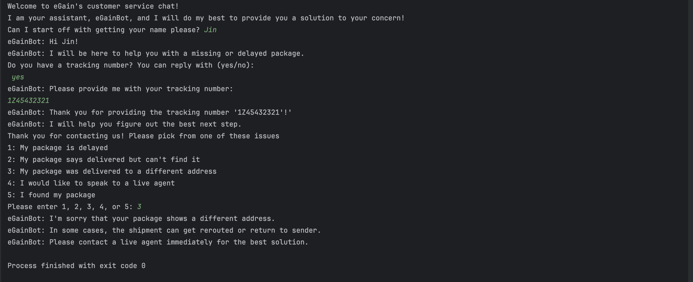
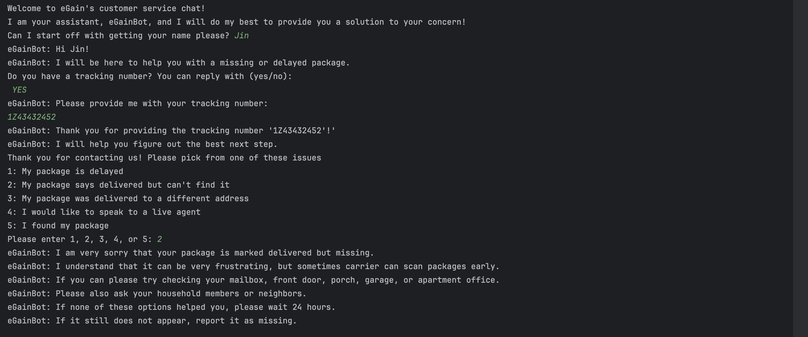
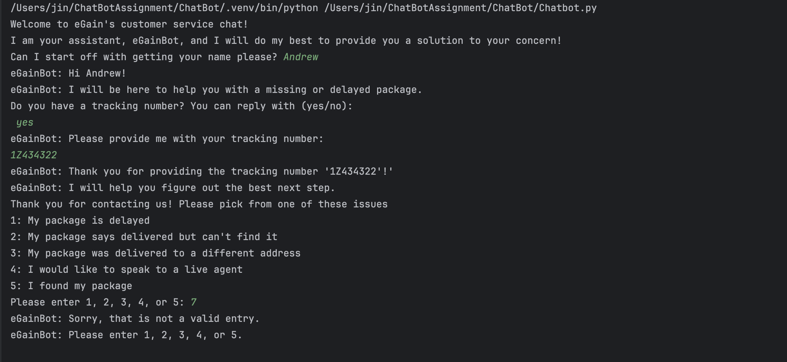
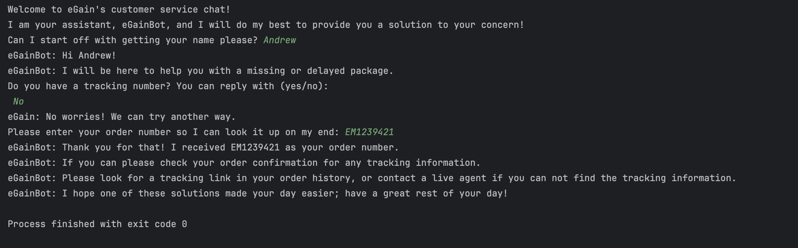

# eGain Chatbot

eGainChatbot is a simple python command-line chatbot that will help customers with lost or delayed packages.

## Features

- Helps customers who have a tracking number
- Helps users who do not have a tracking number
- Handles common issues that customers may experience such as:
    - delayed package
    - shows delivered but missing
    - wrong address
    - support request
- includes error handling for invalid or blank input

## Setup / Installation 
1. Make sure Python 3 is installed (Pycharm).
2. Download or clone this repository
3. Open the project in Pycharm or any Python editor
4. Run the file:
    'Chatbot.py'

## How to run
Open Pycharm:
- Open 'Chatbot.py'
- Click the Run button or control + shift + r on Mac
Or open terminal:
```bash```
python Chatbot.py

## Approach
I designed this chatbot as more of a rule-based conversation flow to help customers track their delayed or lost packages. The chatbot will begin by asking if the customer has a tracking number, which will separate the conversation into two main paths. 
The first path is if the customer has a tracking number, the chatbot asks what issue they are experiencing and provides a recommended next step. The second path is if the user does not have a tracking number, the chatbot will ask for the order information 
and suggests checking their confirmation emails or contact a live agent for immediate support.
For the code section, I kept the code organized by using helper functions to handle input validation by checking for blank input, validating yes or no responses, and by making sure the user selects a valid menu option.
This helps keep the chatbot logic clean and reusable.

## Screenshots
The following examples show different conversation paths and error handling cases handled by the chatbot.
### Delayed Package Example


### Delivered but Missing Example


### Invalid Menu Choice Error Handling


### Invalid Yes/No Input Handling


### No Tracking Number Path

